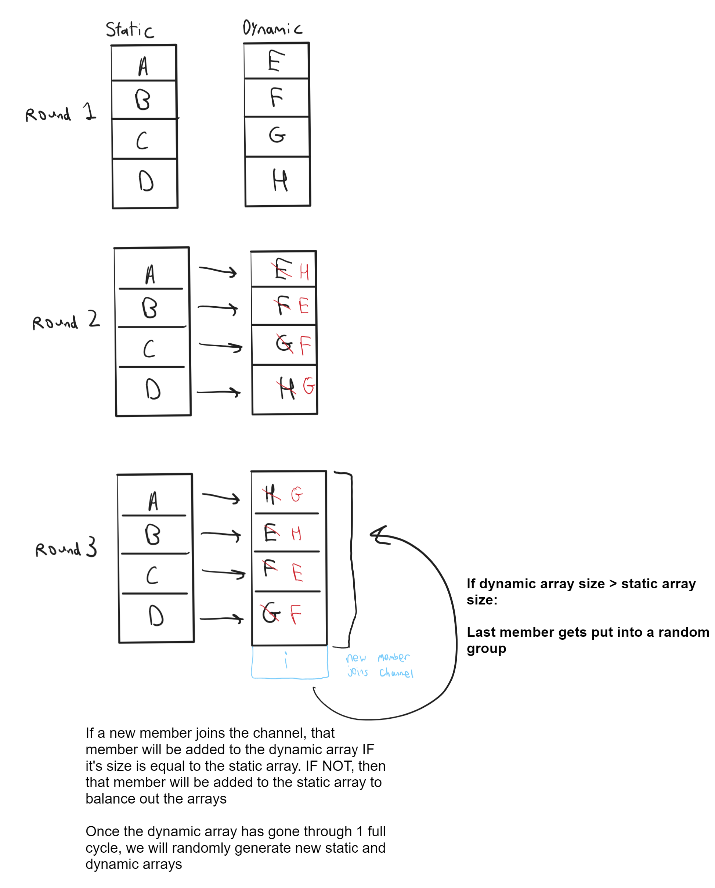

# DinuBot

How DinuBot pairs people together


<!--- Brief description of the project and what it's used for] -->

## Getting started

<!--- Make sure to include any additional steps like setting env variables] -->

Note: If you schedule a message, the message will still be sent after you turn off the bot. This is because Slack remembers it

## Running

```
yarn install
node index.js
```

Remember to set up `.env`.

## Deploying

<!--- Guide on how one would deploy this app -->

## Contributing

Check out our [contribution guidelines](<!--- Link to CONTRIBUTING.md -->)
